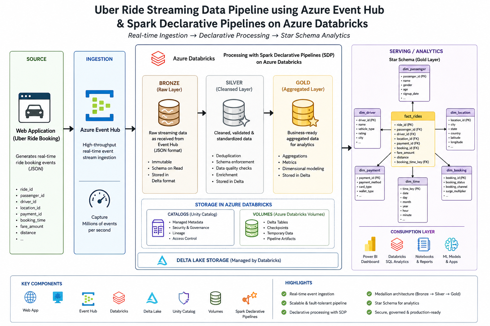

# 🚀 End-to-End Uber Ride Streaming Data Pipeline
Real-Time Data Engineering Project using Azure Event Hub + Spark Declarative Pipelines.

## 📌 Overview

### 📌 Project Overview

This project demonstrates a modern real-time data engineering pipeline built using Azure and Apache Spark. Uber ride booking events are generated through a web application and streamed into Azure Event Hub for real-time ingestion.

The streaming data is processed using Spark Declarative Pipelines (SDP) in Databricks to build a scalable Medallion Architecture (Bronze → Silver → Gold) and transform raw ride events into analytics-ready datasets modeled using a Star Schema.

### 🧠 Problem Statement

Ride-booking platforms generate massive real-time data (rides, drivers, fares, locations). The challenge is to:

- Ingest high-velocity streaming data
- Process it in near real-time
- Transform it into analytics-ready format
- Enable efficient querying for business insights

## 🏗️ Architecture
 

## 🔄 Data Flow
1. Web Application
Simulates Uber ride booking events (user, driver, location, fare, timestamp)
2. Azure Event Hub
Acts as a real-time streaming ingestion layer
Captures continuous ride event data
3. Azure Storage / Databricks Volume
Stores raw streaming data (Bronze layer)
4. Apache Spark (Databricks)
Processes streaming data using Structured Streaming
Applies transformations and data quality checks
5.  Architecture
Bronze → Raw data ingestion
Silver → Cleaned & structured data
Gold → Aggregated & business-level data
6. Star Schema (Gold Layer)
Fact and dimension tables for analytics

## ⚙️ Tech Stack

| Data Source | Web App (Simulated Uber Data)|
| ------------| -----------------------------|
| Data Ingestion | Azure Data Factory |
| Streaming   |	Azure Event Hub              |
| Storage     |	Azure Data Lake / Databricks Volumes |
|Pipeline Framework |	Spark Declarative Pipelines (SDP)
|Processing   |	Apache Spark (Databricks) |
|Transformation	| PySpark / Spark SQL |
|Version Control |	GitHub  |
|Data Modeling	| Star Schema |

## 📊 Data Model (Star Schema)
⭐ Fact Table
fact
 ride_id
 passenger_id
 driver_id
 vehicle_id
 payment_method_id
 pickup_city_id

📐 Dimension Tables
dim_passenger
dim_driver
dim_vehicle
dim_payment
dim_booking
dim_location

This model enables efficient querying for:

Revenue trends
Peak ride hours
Driver performance
Location-based demand

## 🔥 Key Features
✅ Real-time data ingestion using Event Hub
✅ Scalable Spark Structured Streaming pipeline
✅ Medallion architecture (Bronze → Silver → Gold)
✅ Data cleaning and transformation logic
✅ Optimized analytics using Star Schema
✅ Modular and production-ready design

## 🧪 Sample Use Cases
📈 Analyze peak ride demand by time/location
💰 Calculate total revenue per city
🚗 Identify top-performing drivers
⏱️ Monitor ride completion trends in real-time

## 🚀 How to Run the Project
1️⃣ Prerequisites
Azure Subscription
Azure Event Hub setup
Azure Data Factory setup
Azure Databricks workspace
Storage Account / ADLS Gen2
2️⃣ Steps
Deploy Web App to generate ride data
Configure Event Hub for ingestion
Connect Databricks to Event Hub
Run Spark Structured Streaming jobs
Transform data into Silver & Gold layers
Query final data from Gold layer

## 📌 Future Enhancements
🔹 Add real-time dashboard (Power BI / Tableau)
🔹 Implement CI/CD pipeline (Azure DevOps)
🔹 Introduce data quality monitoring
🔹 Integrate ML model for demand prediction

## 💡 Learning Outcomes
Hands-on experience with real-time data pipelines
Deep understanding of Spark Structured Streaming
Practical implementation of data lake architecture
Experience designing analytics-ready data models

